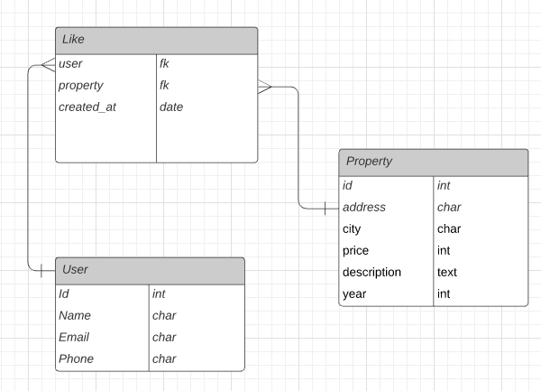

# Habi API

[](https://www.python.org/)
[](https://github.com/psf/black)


## Project

This technical test was worked with django and django rest framework this two is based in python languaje to develop projects easy and fast, in this case consider django is a good idea to complete all topics in the test specially in the develop of rest api with django rest framework.

In first use django in this case to connect with the database (Mysql) for manage the info made a mirror of the db and contruct three basic models, Properties, Status and Status_history that save the info of database habi.

In second with django rest framework create the serialzers and views neccesarys to create the endpoint requested in the test.

Additionally use django-yasg to autogenerate the documentation that is presented in swagger and redocs.

## Docs

To see the full documentation in this case the route is `localhost:port/doc` and `localhost:port/re-doc`.

## Server

For run the server write in shell:

```sh
python manage.py runserver
```

consider that previously create a virtualenv and install the `requirements.txt`

## Properties filters

The property filters is set in the url request to the server in example:

```localhost:8000/api/properties?city=medellin&year=2011&status=en_venta```

we have three filter:

- city
- year
- status

the url can receive one or two and three filter at the same time.

# Like Model

My porpouse for the "like" represent in a model is the next:

```sh
class Like(models.Model):
    user = models.ForeignKey(User)
    property = models.ForeignKey(Property)
    created = models.DateTimeField(auto_now_add=True)
```

where:
- `user` is the relation with the user that give click in th buton like
- `property` is the relation with a property
- `created` is the timestamp that user click in button like

## ER diagram

